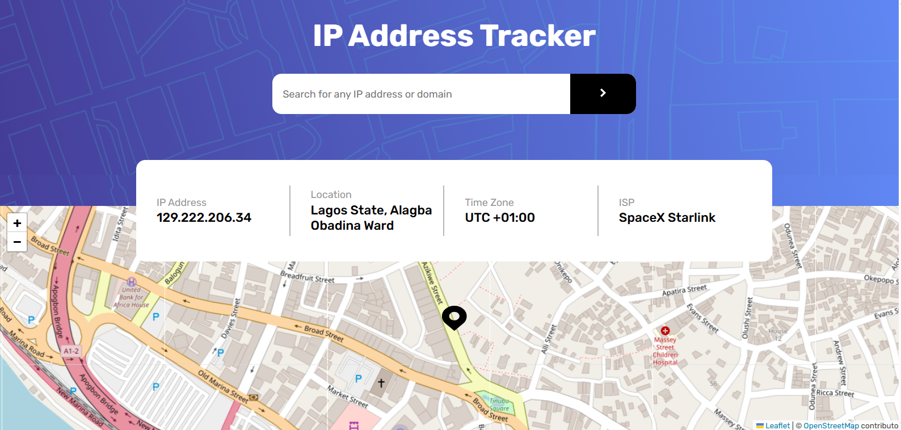

# IP-Address-Tracker

This is a solution to the [IP address tracker challenge on Frontend Mentor](https://www.frontendmentor.io/challenges/ip-address-tracker-I8-0yYAH0).

## Table of contents

- [Overview](#overview)
- [Features](#features)
- [Tech Stack](#tech-stack)
- [How it works](#how-it-works)
- [API Used](#api-used)
- [Learnings](#learnings)
- [Contributions](#contributions)
- [License](#licenses)

## Overview

IP Address tracker is a web application that allows users to search for any IP address or domain name and display its ISP details, timezone and location on an Interactive map.

## Link

https://ip-address-track-er.netlify.app/

## Features

- 🔍 Search for any valid IP address or domain.
- View the exact location on an interactive map 🗺.
- Get timezone and ISP Information
- Fully responsive UI

## Tech Stack

- [React JS] (https://react.dev/) – Frontend Framework
- [Leaflet](https://leafletjs.com/) – Map Rendering
- [Geo.ipify.org API](https://geo.ipify.org/) – Location and IP data provider
- CSS – Styling

## How It Works

- On load, it fetches your current IP address, Location and ISP information.
- Users can enter any IP address or domain to fetch the data.
- Data is displayed on a card on screen and the map updates to show the location.

## API Used

[IP Geolocation API by IPify](https://geo.ipify.org/)

## Learnings

I learned how to work with Leaflet and also used this project as an opportunity to work with external APIs which is something I haven't done in a long time.

Most of all, I learned how to correctly access the values stored in a .env file using React. After getting so many errors from using " process.env.WHATEVER_IS_STORED_THERE", I finally learned that firstly, "process" is not defined. I needed to use "import.meta.env.WHATEVER_IS_STORED_THERE". I also learned that using a REACT app created with VITE, I also needed to add the word "VITE" to the values stored in my env file. I finally accessed it as " import.meta.env.VITE_WHATEVER_IS_STORED_THERE".

Lastly, This is the first time i'm writing a README file for my project, so, It's a plus to the learning aspect.

## Contributions

Contributions are welcome!
Feel free to fork this repo and submit a pull request. For major changes, open an issue first.

## License

MIT – Use it freely in your own projects.

## Contact

Created by Your Name

- Twitter: [@gudluck_reuben](https://twitter.com/intent/follow?screen_name=gudluck_reuben)
- Email: goodluckreuben96@gmail.com
